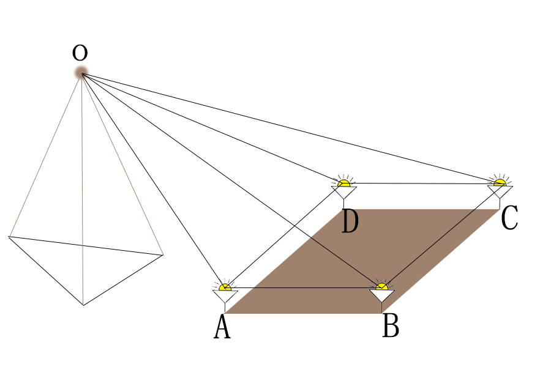

# Location-based-on-Lighthouse
基于Lighthouse的室内定位，计算位置与姿态变化

# 运行环境
以下是我在测试时使用的相关环境
1. win10 操作系统
2. visual studio 2019

# 算法原理
如图所示

&emsp;&emsp;图片中左边为基站位置，基站不停向外界发送横扫光与竖扫光，而接收器可以接收到基站发出的光信号，通过横扫光与竖扫光可以得到基站与传感器之间的方向向量。具体硬件原理可参考https://github.com/ashtuchkin/vive-diy-position-sensor

&emsp;&emsp;那么，如图所示，AB,BC,CD,AD,AC,AD的长度已知，OA,OB,OC,OD的方向已知，可通过余弦定理或者向量的方式计算出OA,OB,OC,OD的长度，从而得出其位置的变化。再将初始位置作为参考点计算每个传感器的相对位移的变化可计算出旋转矩阵，可将其转换为姿态角（roll,pitch,yaw），最终的位姿的变化

&emsp;&emsp;本实验使用LM算法用于计算方程的解，具体算法可参考代码

# 实验设置与精度
&emsp;&emsp;传感器距离基站越近，其精度越高，因为当距离越远时，计算距离的方程会呈现出一种病态，导致误差较大。在实验中，我们设置的距离为1.6m左右。定点误差大约在5mm左右，可用于室内的超精准位姿估计。

# 使用方法
&emsp;&emsp;我已将函数封装好，直接运行主函数即可，本版本准备部署到stm32板子中，直接在板子上运算，可提高整体的便携性。另外，我还写了一个python版本的定位算法，如果后续还有需要再上传。